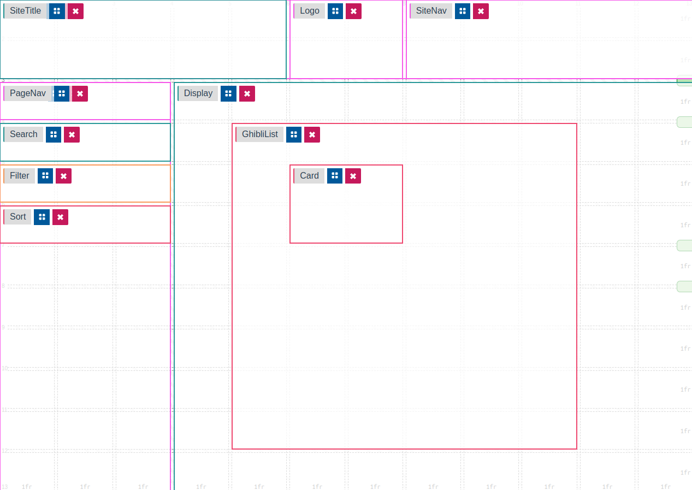

# Ghibli Characters List using Context API

### Purpose

An example of using the Context API for managing global state and enabling users to toggle between dark/light themes.

Utilizing the Studio Ghibli API @ https://ghibliapi.herokuapp.com/

Built using [Next.js](https://nextjs.org/) and [TailwindCSS](https://tailwindcss.com/)

### Initial Layout Structure

